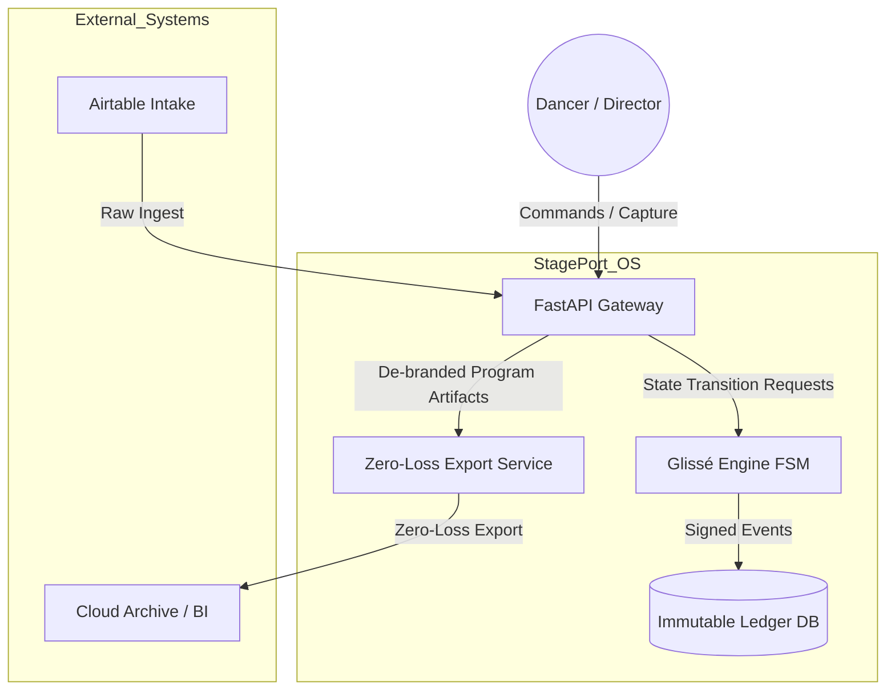
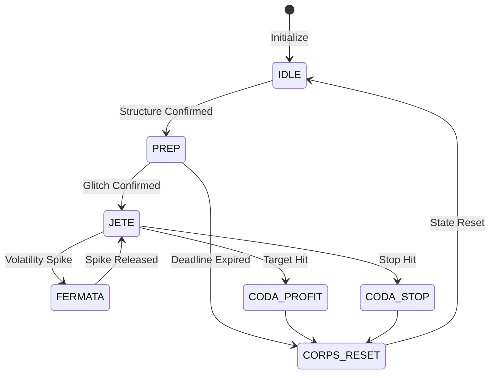

# StagePort StudioOS Sovereign Stack Architecture

This document translates the StagePort StudioOS epic map into an enterprise-grade, auditable system design using the **Sovereign Stack** pattern:

- **The Ledger**: deterministic, immutable recordkeeping.
- **The Heart**: probabilistic movement and signal interpretation.
- **The Director's Chair**: strategic oversight, controls, and intervention.

## 1) Enterprise Architecture Blueprint

StagePort operates as a layered architecture to preserve register integrity across Broadcast, Simulation, Operating System, and Ledger faces.



### Layer responsibilities

1. **Interface Layer (Broadcast + Director's Chair)**
   - Mobile shortcuts, director console, and ingestion APIs.
   - Enforces authN/authZ and request validation.
2. **Orchestration Layer (Operating System)**
   - Glissé Engine controls lifecycle transitions.
   - Guarantees valid state progression and timeout handling.
3. **Intelligence Layer (Heart)**
   - Computes movement confidence, volatility heuristics, and prioritization.
   - Outputs recommendations; never mutates ledger directly.
4. **Evidence Layer (Ledger)**
   - Append-only forensic history with content hash seals.
   - Supports replay, audit, and legal provenance.

## 2) Glissé Engine FSM (Deterministic Backbone)

Every trade/movement/decision object must map to a deterministic lifecycle:



### Transition controls

- **Guards**: each edge requires explicit predicates (`structure_confirmed`, `deadline_expired`, etc.).
- **Timeout policy**: PREP auto-expires to `CORPS_RESET` if no valid trigger occurs.
- **Idempotency**: duplicate transition requests must resolve to no-op with trace output.
- **Audit event emission**: every accepted/rejected transition writes a ledger event.

## 3) Forensic Seal Ledger Implementation

### Domain model

```python
from sqlalchemy import Column, Integer, String, JSON, DateTime
from hashlib import sha256
import json

class LedgerEntry(Base):
    __tablename__ = "ledger_entries"
    id = Column(Integer, primary_key=True)
    timestamp = Column(DateTime)
    kind = Column(String)  # e.g., 'bbank_accrual', 'pyrouette_node'
    receipt_hash = Column(String, unique=True)
    payload = Column(JSON)

    def generate_seal(self):
        raw_data = f"{self.kind}{json.dumps(self.payload, sort_keys=True)}{self.timestamp.isoformat()}"
        self.receipt_hash = sha256(raw_data.encode()).hexdigest()
```

### Enterprise hardening controls

- Use `sort_keys=True` for deterministic JSON serialization.
- Add DB uniqueness index on `receipt_hash` and optional `(kind, timestamp)` index for analytics.
- Treat ledger as append-only; corrections use compensating entries.
- Include request metadata (`actor_id`, `source`, `fsm_state_before`, `fsm_state_after`) in payload.
- Run weekly **Sunday Ritual Sweeper** integrity scan to recompute and verify seals.

## 4) Revenue Architecture: 6-Surface Pipeline

| Funnel Stage | Surface Target           | Monetization Mechanism                            |
| ------------ | ------------------------ | ------------------------------------------------- |
| Awareness    | Surface 1: Live Remote   | Subscription access to Broadcast-state classes    |
| Education    | Surface 2: On-Demand     | Single-purchase curriculum bricks (e.g., ET-CORE) |
| Activation   | Surface 3: Intensive     | High-ticket Simulation workshops                  |
| Retention    | Surface 4: Assessment    | Recurring technical PyRouette audits              |
| Authority    | Surface 5: Certification | Annual licensing for Leadership Track instructors |
| Scale        | Surface 6: White-Label   | Enterprise StudioOS B2B licensing                 |

### Operational revenue flow

1. **Ingest**: capture raw behavioral and command data.
2. **Fixation**: convert to ChunkCard + assign revenue lane.
3. **Distribution**: export de-branded artifact into the 6-surface channel.

## 5) Pearl Nacre Protocol (Design Tokens)

| Token           | Hex       | Usage                                  |
| --------------- | --------- | -------------------------------------- |
| Pearl Main      | `#E2DFD2` | Backgrounds and primary surfaces       |
| Nacre Highlight | `#F6D3C0` | Primary buttons and active indicators  |
| Teal Accrual    | `#A0F4F6` | Positive financial/Ballet Bank trends  |
| Vellum Soft     | `#F4E3E3` | Secondary containers and inactive tabs |
| Gold Evidence   | `#EACC71` | Validated ledger receipts and hashes   |

## 6) Graham Glitch Deployment Strategy

### MVP posture: survivability-first

- Start with a **crude v1** that protects core constraints (state validity + immutable evidence).
- Accept noisy/glitchy inputs while preserving deterministic ledger output.
- Reserve advanced optimization until real movement data accumulates.

### Weekly operational ritual

- Sunday Sweeper job:
  1. Verify hash seals for all new ledger entries.
  2. Detect orphaned FSM sessions and force reset policy.
  3. Produce signed integrity report and archive to cloud evidence room.

## 7) Implementation Sequence (90-day)

1. **Foundation (Weeks 1-3)**
   - FastAPI service scaffold + auth + request schemas.
   - SQLAlchemy ledger table + forensic sealing utilities.
2. **State Core (Weeks 4-6)**
   - Glissé Engine FSM with guarded transitions.
   - Transition event log + replay tooling.
3. **Revenue Binding (Weeks 7-9)**
   - ChunkCard generation + 6-surface routing tags.
   - Artifact export worker for distribution channels.
4. **Assurance (Weeks 10-12)**
   - Sunday Sweeper + integrity dashboard.
   - Operational runbooks and incident playbook.

## 8) Non-Negotiable Invariants

- No state transition without guard validation.
- No accepted transition without ledger event.
- No ledger mutation after seal issuance (append-only).
- No monetization artifact without source lineage to ledger receipts.

These invariants are the minimum bar for sovereign, enterprise-grade operation.
