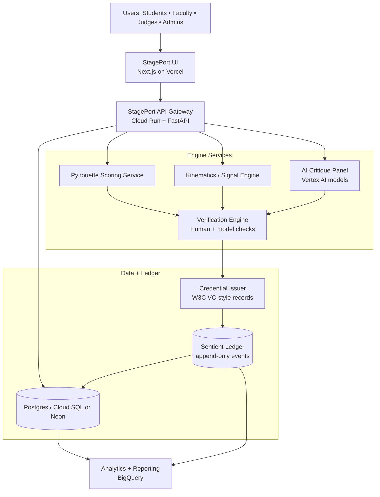

# StagePort Google-Ready Reference Architecture

This document translates the StagePort stack into infrastructure language that cloud reviewers can parse quickly.

## 1) Platform Shape (Three Layers)

1. **Operating System Layer (Studio Governance)**
   - People, projects, roles, offers, compliance, and ledger supervision.
2. **Engine Layer (Specialized Compute)**
   - Py.rouette scoring, kinematics signal analysis, critique/risk engines.
3. **Economy Layer (Credential + Value Loop)**
   - Score -> credential -> badge/token -> opportunity -> repeat.

## 2) GCP-Mapped System Diagram



## 3) Core Lifecycle (Product Logic)

```text
practice -> score -> credential -> audit report -> token economy
```

Operationally:

```text
data ingestion -> analysis -> economic output -> governance update
```

## 4) Service Boundaries (Deployable Units)

- `stageport-ui`: frontend and operator dashboards.
- `stageport-api`: auth, RBAC, scheduling, and orchestration.
- `engine-pyrouette`: technical scoring of movement events.
- `engine-kinematics`: thresholds, hysteresis, and motion signals.
- `engine-judge`: style-aware critique pathways.
- `engine-verification`: evidence reconciliation + integrity caps.
- `service-credentials`: signed credential issuance and revocation.
- `service-ledger`: append-only financial/proof events.
- `service-reporting`: compliance exports (including Title IX-ready outputs).

## 5) Proof-of-Deployment Sequence

### Phase 1 — Working reference deployment

- Real login + role permissions.
- Real class/session objects.
- Real scoring event path to ledger.

### Phase 2 — Evidence capture

- Usage metrics and event throughput.
- Deployment logs and incident notes.
- Sample credential and compliance reports.

### Phase 3 — Partner-facing architecture pack

- System vision diagram.
- Cloud infrastructure diagram.
- Data flow + controls diagram.
- Installation/deployment runbook.

## 6) Architecture Invariants

- No credential without verifiable score evidence.
- No token/value event without ledger lineage.
- No governance report without replayable source records.
- Human oversight remains available at every verification checkpoint.
