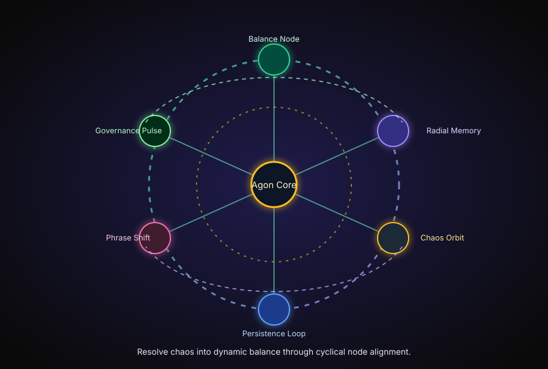

# Agon Engine

The **Agon Engine** isn’t just a tool—it’s a system to explore balance itself.

- In **choreography**, Agon represents phrases that shift tensions, align movements, or reset space.
- In **governance**, it mirrors how systems negotiate chaos and resolve into dynamic unity.

Through the Agon Engine, you’ll explore how:

- **Movement nodes** govern cycles of phrasing and memory-anchored persistence.
- **Radial mythematics** allow systems—and the humans who collaborate—to dance across space and time.

This is your invitation: press play and resolve chaos into balance.

## Try It Out: Dancing with Agon

Choose your way to explore:

- **Balance a Node:** teach Agon’s system to resolve a simple imbalance between two forces.
- **Tune Radial Memory Persistence:** adjust phrasing loops to see how movement persists in time.
- **Orchestrate Chaos:** run the simulation and let Agon align a rotating web of nodes.

## How to Run

```bash
git clone https://github.com/TheAVCfiles/vite-react.git --branch agon
cd vite-react
npm install
npm start
```

## Visual Model

The radial movement loop below shows how distributed nodes continuously re-align around the Agon core.



## Interactive Demo (future-ready)

- **Live demo link:** _Coming soon_
- **Video walkthrough:** _Coming soon_

> As the simulation matures, this section should point to a public demo and a short capture of phrasing logic in motion.

## Join the Movement 🌌

Want to expand Agon? Let’s co-create:

- Open an issue to discuss your own memory/governance/phrasing ideas.
- Share creative applications or implementation ideas with the community.
- Remix the radial movement model for choreography, governance experiments, or educational play.

---

## Repository Notes

This `project/` directory also includes related artifacts and prototypes:

- `index.html`: single-page dark-themed portal experience.
- `studio-portal.jsx`: StudioOS operator interface extension.
- `ecosystem_map.md`: compact architecture + integration map artifact.
- `pilot-leverage-playbook.md`: framework for converting fixed-scope pilots into reusable governance infrastructure artifacts.
- `prima-first-dreamm.html`: standalone publishing page.
- `founderos/`: FounderOS v0 scaffold.
- `paygait-local.html`: local PayGait prototype.
- `contracts/`: ERC-20 smart contract workspace and Hardhat setup.
